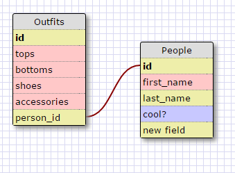

# 8.4 Database Schemas
### Release 5 Queries

1. SELECT * FROM States;
2. SELECT * FROM Regions;
3. SELECT state_name, population FROM States;
4. SELECT state_name, population 
FROM States 
ORDER BY population DESC;
5. SELECT state_name 
FROM States 
WHERE region_id == 7;
6. SELECT state_name, population_density
FROM States
WHERE population_density > 50
ORDER BY population_density ASC;
7. SELECT state_name
FROM States
WHERE population > 1000000 && population < 1500000;
8. SELECT state_name, region_id
FROM States
ORDER BY region_id ASC;
9. SELECT region_name
FROM Regions
WHERE region_name LIKE '%central%';
10. SELECT Regions.region_name, States.state_name
FROM States
INNER JOIN Regions
ON States.region_id=Regions.id
ORDER BY States.region_id ASC;

### Release 6

## ["Reflections"](https://www.youtube.com/watch?v=fBrOwiHO-5w)

####What are databases for?

Databases are for easily storing huge amounts of information. 
By separating the storage from the actual code, you can boost
reliability, stability, speed and leanness of your code. It
is an absolute must if you are going to have multiple people
accessing your data at the same time.

####What is a one-to-many relationship?

When 'one' row can relate to 'many' columns in another table.
This helps to not repeat yourself since numbers are much easier
to store and sort than Strings.

####What is a primary key? What is a foreign key? How can you determine which is which?

A Primary key is a unique identifier so you can easily pick out
a row. Much of the time databases create their own to prevent
issues.

####How can you select information out of a SQL database? What are some general guidelines for that?

You have to use a SELECT [column] FROM [table]; statement. You
can add all sorts of qualifiers before the semicolon to refine
your query. A good guideline would be to try and memorize the
clauses and then you can treat queries like senetences: Select
X from y where x > y; It makes sense with some effort. Also
separate long queries into subclauses for readability.