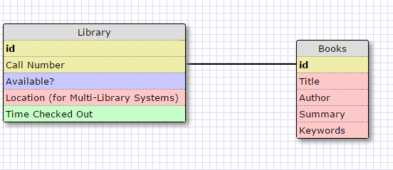
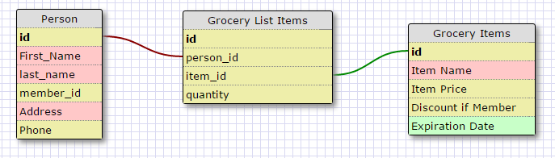

# More Schemas!!

### Release 2

For my one-to-one schema I made a simple Library database. The relationship is one to
one because each book has a specific call number associated with it, even if they have
multiple copies of the same book. Although I was a little confused on how you would 
implement a search by title with such a system.

### Release 3

## Release 6

###What is a one-to-one database?

A one to one database stores information in which there is a one-to-one correspondence.
A user's address and information, for instance, might be stored separate from their
account information. Both are unique to one specific customer, but it is better practice
and better for querying to separate them in logical fashion.

###When would you use a one-to-one database? (Think generally, not in terms of the example you created).

It seems to me to make sense to keep information nice and tidy, and part of that is
to use one-to-one databases to keep databases in logical order. I think you could
almost always expand a database instead of using 1-to-1, but that would put a lot of
overhead on certain database queries. That will only get worse as parts of the data
get linked to other parts of data.

###What is a many-to-many database?

A database in which there can be many instances of these interconnections. Amazon keeps
track of purchase, both by users and by product. Users by many different products and 
products are bought by many different users, storing that data requires a many-to-many
relationship.

###When would you use a many-to-many database? (Think generally, not in terms of the example you created).

Anytime you have a lot of overlap such as in the example for the previous question.

###What is confusing about database schemas? What makes sense?

For me, designing them visually I think oversimplifies the size. I found myself
wondering during the grocery lists how I would get all the items on the list with
the way I set everything up. The answer is that these obviously represent datasets
and not an object in a program, which is taking me a little bit of getting used to.
